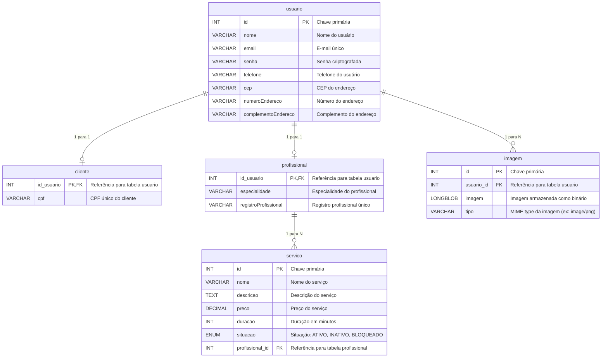

## Estrutura do Projeto
Tecnologias Utilizadas:
- Maven: Gerenciador de dependências.
- Lombok: Para reduzir boilerplate (getters, setters, etc.).
- Spring Boot: Framework para criar a API REST.
- Spring Data JPA: Para persistência de dados.
- Banco H2: Banco de dados em memória, ideal para desenvolvimento e testes.
- Heroku: Plataforma para publicação.
Padrão de Projeto:
- Usaremos MVC (Model-View-Controller) para organizar as camadas do sistema.

### Diagrama de ER
Segue o diagrama de ER do esquema do banco de dados gerado em Mermaid para documentação:



## Explicação do Diagrama
Tabelas principais:
usuario: Base de todas as entidades, representando informações compartilhadas.
cliente e profissional: Estendem usuario com atributos específicos para cada tipo de usuário.
servico: Associado a um profissional, detalha os serviços oferecidos.
imagem: Tabela separada para armazenar imagens relacionadas aos usuários.
Relacionamentos:
usuario é pai de cliente e profissional (herança 1-para-1).
profissional está relacionado a servico (1-para-muitos).
usuario está relacionado a imagem (1-para-muitos), permitindo múltiplas imagens por usuário.
Esse diagrama documenta claramente o modelo de dados e pode ser usado como referência para o desenvolvimento e comunicação do projeto.

### Teste com Postman
Você pode testar os seguintes endpoints no Postman:

GET /api/servicos - Listar todos os serviços.
GET /api/servicos/{id} - Buscar um serviço por ID.
POST /api/servicos - Criar um novo serviço.
``` json
{
    "nome": "Massagem Boa",
    "descricao": "Uma massagem relaxante de 60 minutos.",
    "preco": 100.0,
    "duracao": "60",
    "profissional": {
        "id": 1
    }
}
```

PUT /api/servicos/{id} - Atualizar um serviço existente.
DELETE /api/servicos/{id} - Excluir um serviço.


POST http://localhost:8080/api/profissionais
``` json
{
        "nome": "Emy Eiras",
        "email": "Emy@gmail.com",
        "senha": "senha444",
        "telefone": "(48) 98888-4444",
        "cep": "88020-444",
        "numeroEndereco": "444",
        "complementoEndereco": "Sala",
        "especialidade": "Fisioterapeuta",
        "registroProfissional": "REG44444"
    }
```
POST http://localhost:8080/api/clientes
``` json
{
        "nome": "Dani Damares",
        "email": "dani@gmail.com",
        "senha": "senha333",
        "telefone": "(48) 98888-3333",
        "cep": "88020-333",
        "numeroEndereco": "333",
        "complementoEndereco": "Casa",
        "cpf": "98765432333"
    }
```
POST http://localhost:8080/api/agendamentos
``` json
{
    "cliente": {
        "id": 1
    },
    "servico": {
        "id": 1
    },
    "dataHora": "2024-01-12T10:00:00"
}
```